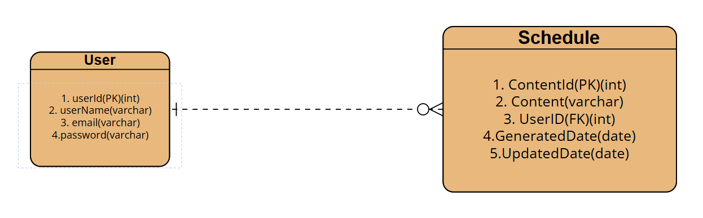

#calender

| 기능      | 메소드명            | URL                 | 요청내용                                                                                                   | Response 예시                                                                                                                                                   | 상태코드      |
|---------|-----------------|---------------------|--------------------------------------------------------------------------------------------------------|---------------------------------------------------------------------------------------------------------------------------------------------------------------|-----------|
| 일정 등록   | createSchedule  | /api/schedules      | Body:{"content": "스터디 모임","userName": "user", "password": "1234", "email": "user@user.com"}            | {"userName": "user", "contentId": {id}, "content": "스터디", "userId": {userId}, "generatedTime": "2025-05-08"T12:00:00", "modifiedTime": "2025-05-08T12:00:01"} | 200: 등록완료 |
| 일정 조회   | getScheduleById | /api/schedules/{Id} | Param: scheduleId = {id}                                                                               | {"userName": "user", "contentId": {id}, "content": "스터디", "userId": {userId}, "generatedTime": "2025-05-08"T12:00:00", "modifiedTime": "2025-05-08T12:00:01"} | 200: 조회완료 |
| 일정 전체조회 | getSchedules    | /api/schedules      | 없음                                                                                                     | {"userName": "user", "contentId": {id}, "content": "스터디", "userId": {userId}, "generatedTime": "2025-05-08"T12:00:00", "modifiedTime": "2025-05-08T12:00:01"} | 200: 조회완료 |
| 일정 수정   | updateSchedule  | /api/schedules/{Id} | Param: scheduleId = {id}, Body:{"content": "스터디 장소 변경","userName": "modifieduser", "password": "1234"} | {"userName": "user", "contentId": {id}, "content": "스터디", "userId": {userId}, "generatedTime": "2025-05-08"T12:00:00", "modifiedTime": "2025-05-08T12:00:01"} | 200: 수정완료 |
| 일정 삭제   | deleteSchedule  | /api/schedules/{Id} | Param: scheduleId = {id}                                                                               | 없음                                                                                                                                                            | 200: 삭제완료 |
---

v1.0.0
sql작성

v1.0.1
각 기능 초기코드 구현

v1.1.0
일정 생성기능 구현
전체일정 조회 기능 구현
일정 삭제 기능 구현

v1.2.0
일정 수정 기능 구현
일정 삭제 기능 구현

v1.3.0
페이지네이션 구현

v1.3.1
불필요 코드 제거

v1.3.2
불필요 코드 제거

v1.3.3
README 수정